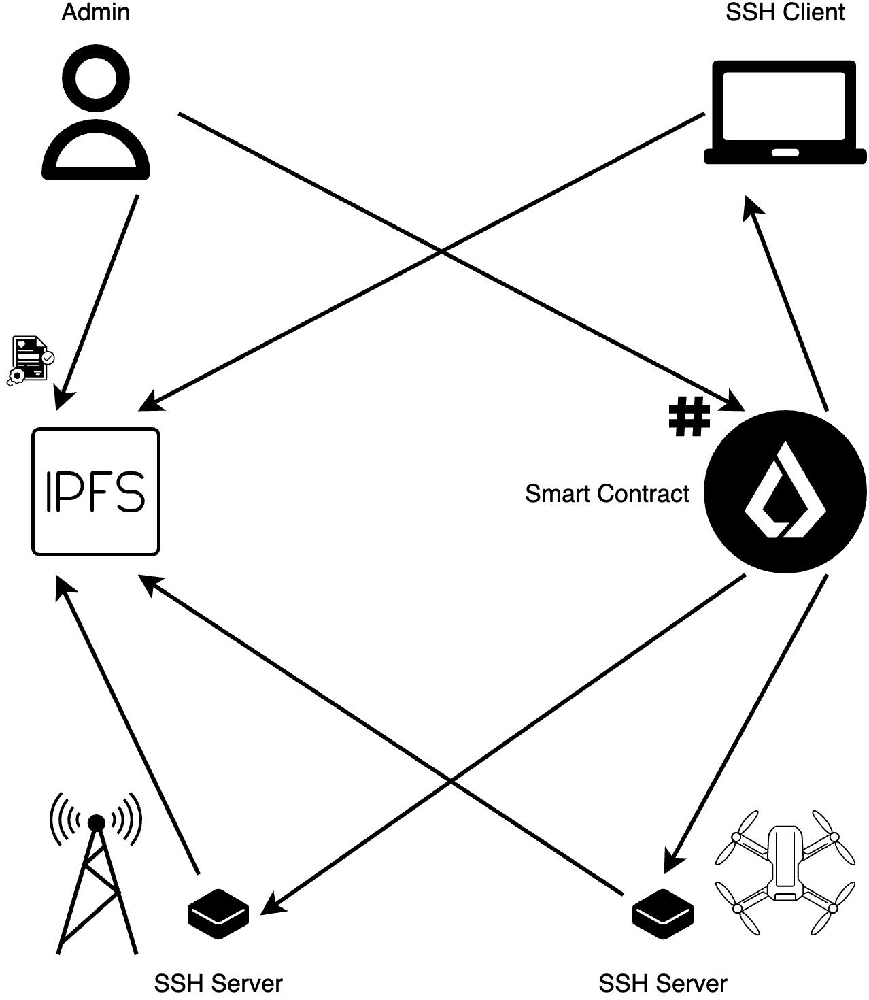

# DPKI

Decentralized Public Key Infrastructure.

- [Here you can check sequence diagram to understand](./docs/render/Flow.png) **how it works**.
- [Chain of trust description](./docs/chain_of_trust.md) **and how it works**.

<br>

<p align="center">
  
</p>

## VSCode

.vscode/settings.json

```json
{
  "solidity.packageDefaultDependenciesContractsDirectory": "contracts/src",
  "solidity.packageDefaultDependenciesDirectory": "contracts/lib",
  "solidity.formatter": "forge",
  "solidity.compileUsingRemoteVersion": "v0.8.23+commit.f704f362",
}
```
