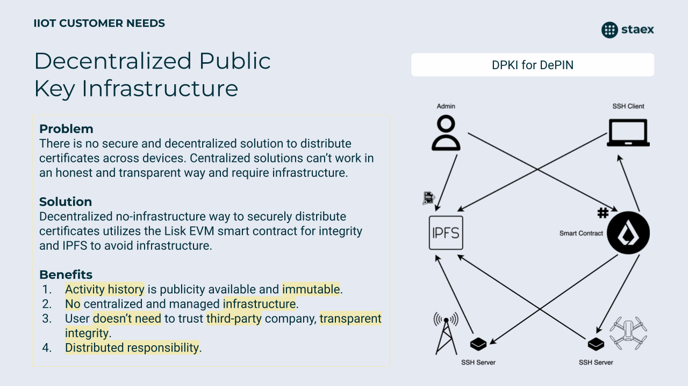

# DPKI

Decentralized Public Key Infrastructure.

This project is intended to improve security and usability of keys distribution and make chain of trust more distributed.

This theme is very crucial for IIoT and DePIN sector. There are a lot of new devices setup every day with various purposes, from home to industrial. IIoT area is expected billion of devices in the near future. To have secure and automated infrastructure for certificates distributing and rotation is important for proper, healthy and secure work of the any project or company. Here we come with DPKI solution for DePIN.

| Problem | Solution |
| - | - |
| There is **no secure** and decentralized solution to distribute certificates across devices. Centralized solutions **can’t work** in an **honest and transparent** way and **require infrastructure**. | Decentralized **no-infrastructure** way to **securely distribute** certificates utilizes the **Lisk** EVM smart contract for **integrity** and IPFS to **avoid infrastructure**. |

- [Here you can check sequence diagram to understand](./docs/render/Flow.png) **how it works**.
- [Chain of trust description](./docs/chain_of_trust.md) **and how it works**.

In simple words, we propose a way to generate a new key pair for any client or server by the admin user. Sign them using the Certificate Authority (CA). Then, using Diffie-Hellman key exchange, encrypt this key pair and distribute it through IPFS. To verify the integrity of the key pair, customer can use the smart contract. It can notify clients about new key pair availability through the smart contract and claim key pair hashes. After downloading it from IPFS and decryption, client can apply key pair locally (for example new SSH key pair or SSH CA). With such an approach, the **client** can be **sure** that this **key pair belongs** to the **particular admin** and can **trust** it. And by **encrypted way** of distribution **keys** can be **rotated often** to **improve** overall **system security.** Last but not least, everything can be done **without centralized servers** and **doesn't require** to have **own infrastructure.**

**Such system can work with any type of certificates or logic which require to distribute private information over the network.**

**To summarize points:**

1. All actions with certificate authorities and key pairs are publicity available.
2. System activity history is immutable.
3. Safe distribution of new certificates and key pairs.
4. Fast certificates and key pairs rotation.
5. Doesn't require centralized or cloud infrastructure at all.
6. Distributed trust model to improve fault tolerance against system violation.
7. Even your root certificate authority will be hacked it can be changed quickly.
8. Certificates and key pairs storage is distrusted.
9. Smart contracts are publicity available, everyone can check integrity logic and how system works.
10. Only user which has smart contract private key can issue or revoke certificate, not centralized third-party layer.

## Use-cases

Here are real examples of such system usage.

### SSH keys rotation

The simplest way to improve overall system security while working with SSH - often keys rotation. Rotation flow is quite straightforward:

1. Issue new SSH key pair
2. Sign issued key pair with certificate authority key pair
3. Deliver new key pair to device
4. Revoke old key pair

With our system such flow can be done frequently and securely.

### IIoT device access

For example user has an IIoT device and user needs access to it for 5 minutes only. User can issue new temporary SSH (or other) key pair, deliver it to the device and after doing some work revoke it. So it is easy and fast device access solution with secure rollback flow to avoid accessing device by hacker while it doesn't need remote access.

### Microservices communication

Microservices require secure communication with each other. With DPKI solution we can provide new key pair for every microservice deployed to the cloud and distribute it public key to other microservice. With such an approach communication between microservice will be secure and automatically initiated.
