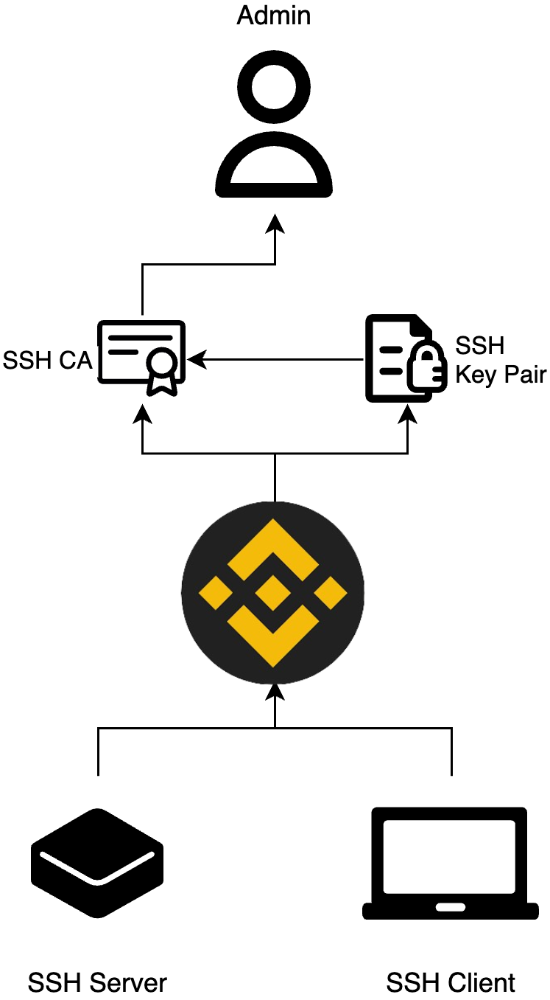
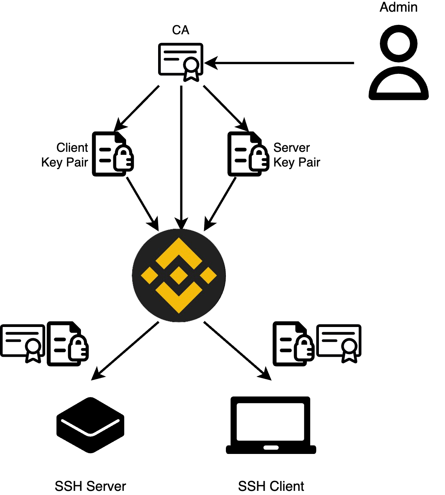
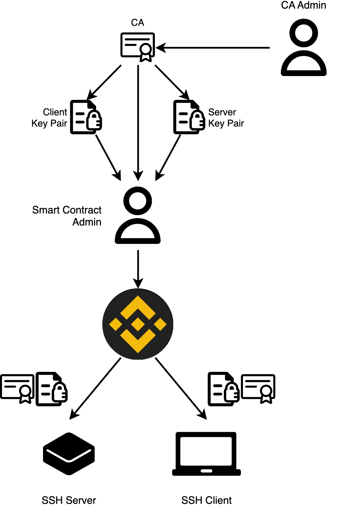
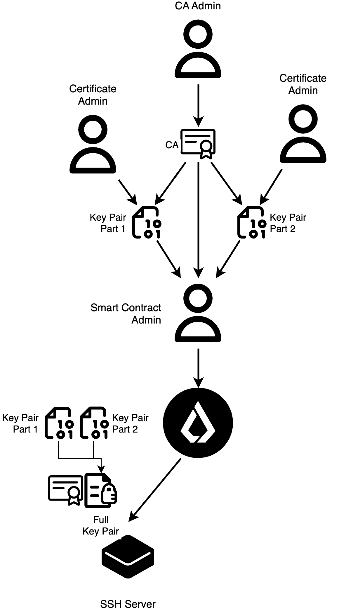

# Chain of trust

This is the description of the chain of trust model.

## General

1. In general every entity like SSH server or SSH client trusts smart contract. They filters actions and events of smart contract by admin public key.
2. Smart contract "trust" SSH CA and SSH key pair as they were uploaded using admin signature (private key).
3. SSH key pair trusts SSH CA.
4. SSH CA trusts admin.
5. Admin trusts themself.

  

## Distribution

### Simple

In this chain of trust model, organization has one admin user. This user should issue Certificate Authority (CA) key pair, client key pair and server key pair. Client key pair and server key pair should be signed by CA key pair. Than it needs to claim public keys of every pair with the smart contract.

SSH Server and SSH client trust admin public key which it uses to interact with smart contract. They can download and trust new CA certificate after validation it using admin public key. Then they can download SSH key pair and validate that key pair was signed by SSH CA.

  

---

  

---

  

---
