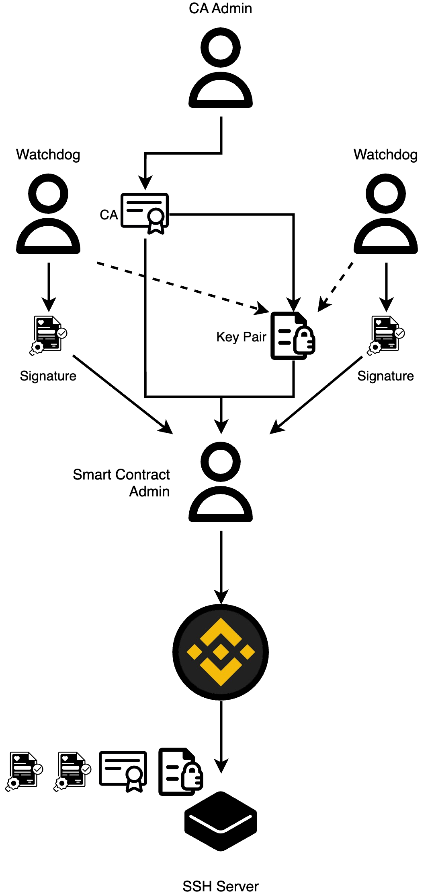

# Chain of trust

This is the description of the chain of trust model.

## Chain

1. In general every entity like SSH server or SSH client trusts smart contract. They filters actions and events of smart contract by admin public key.
2. Smart contract "trust" SSH CA and SSH key pair as they were uploaded using admin signature (private key).
3. SSH key pair trusts SSH CA.
4. SSH CA trusts admin.
5. Admin trusts themself.

  

## Distribution

### Simple

In this chain of trust model, organization has one admin user. This user should issue Certificate Authority (CA) key pair, client key pair and server key pair. Client key pair and server key pair should be signed by CA key pair. Than it needs to claim public keys of every pair with the smart contract.

SSH Server and SSH client trust admin public key which it uses to interact with smart contract. They can download and trust new CA certificate after validation it using admin public key. Then they can download SSH key pair and validate that key pair was signed by SSH CA.

  

### Multi-admin

In this chain of trust model, organization has two separate admins.

First admin (CA Admin) is responsible for generation new Certificate Authorities key pairs (CA), for generation new key pairs for clients and server and for sign key pairs using CA private key.

Second admin (Smart Contract Admin) is responsible for interacting with smart contract. This admin has private key of the wallet. SSH server and SSH client trust this admin public key when listen for new events from the smart contract.

With two admins model we can achieve distributed responsibility. If one of the admins start to do suspicious actions, second admin can refuse their action and stop violation.

  

### Multisig

In this chain of trust model, organization has at least three separate admins.

First type of admins and third type are the same as in multi-admin chain of trust model.

But second type of admin (Watchdog) is a new type. They are responsible for signing key pairs from CA Admin using their own private keys.

SSH server after downloading new CA and new SSH key pair, is required to check that key pair is not only signed by CA, but is also signed by all watchdogs. SSH server should have a list of watchdog's public keys to check these signatures (alternative solution is to claim such list using smart contract and it should be Smart Contract Admin responsibility).

  

With such chain of trust distribution model we can achieve much more responsibility distribution and make a change of suspicious activity much lower.
